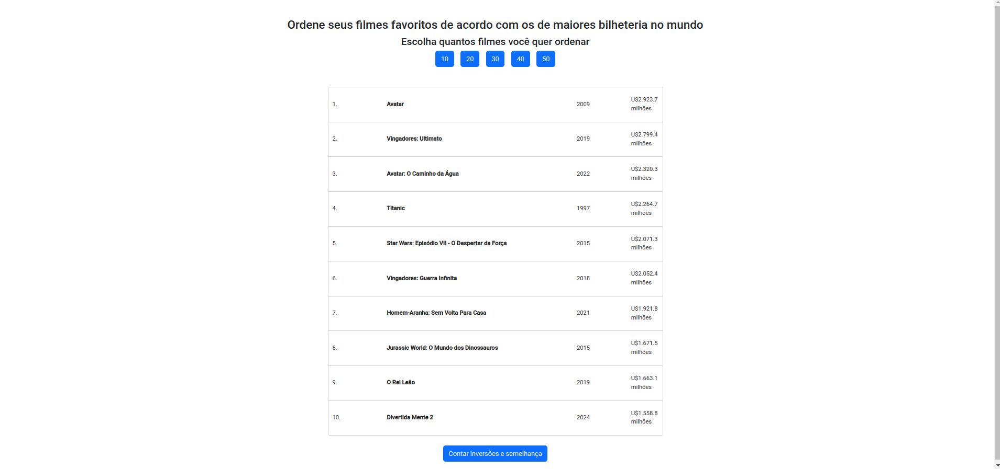
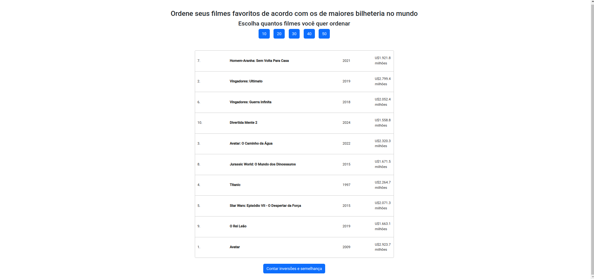
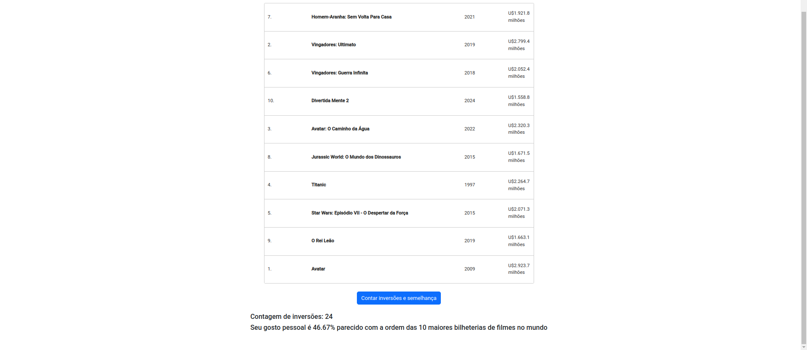

# Filmes favoritos

**Número da Lista**: 4 
**Conteúdo da Disciplina**: Dividir e Conquistar 

## Alunos
|Matrícula | Aluno |
| -- | -- |
| 19/0046848  |  Laís Portela de Aguuiar |

## Vídeo apresentação
O vídeo de apresentação foi compartilhado no [google drive](https://drive.google.com/file/d/1WT7Abm8qYlnMXpYsdSj81oNhvpCsfWNF/view?usp=sharing). Por padrão, os videos ficam em baixa qualidade no google drive, para ver na resolução original é só baixar. 

## Sobre 
Criação de um site que recebe as 50 maiores bilheterias do mundo até o dia 07 de agosto de 2024 e possibilita que o usuário ordene os filmes de acordo com o seu gosto pessoal, para depois mostrar o quanto o seu gosto é parecido com os filmes de maior bilheteria. O usuário pode escolher entre 10, 20, 30, 40 ou 50 filmes para ordenar.

## Screenshots

## Instalação 
**Linguagem**: Typescript 
**Framework**: Angular 
Para rodar este projeto, você precisará ter as seguintes ferramentas instaladas em sua máquina:
1. Node.js (versão mais atualizada) e npm 
2. Angular CLI
    Instale globalmente utilizando o comando:
        npm install -g @angular/cli

Depois de baixar as depedências necessárias basta clonar o reposítorio, ir na pasta agendamento e executar os seguintes comandos:
1. npm install
2. ng serve

## Uso 
Após entrar no site, basta escolher o número de filmes e ordená-los de acordo com o seu gosto pessoal.

